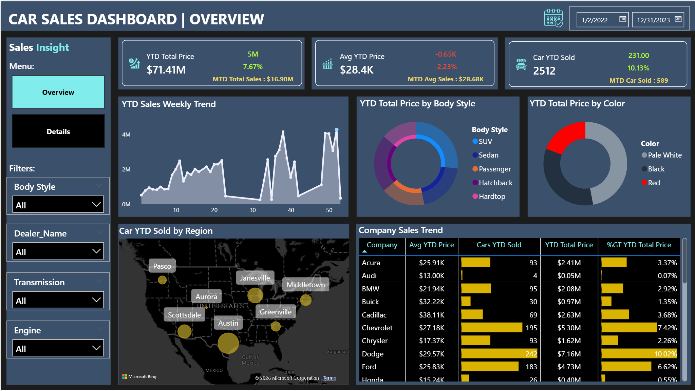
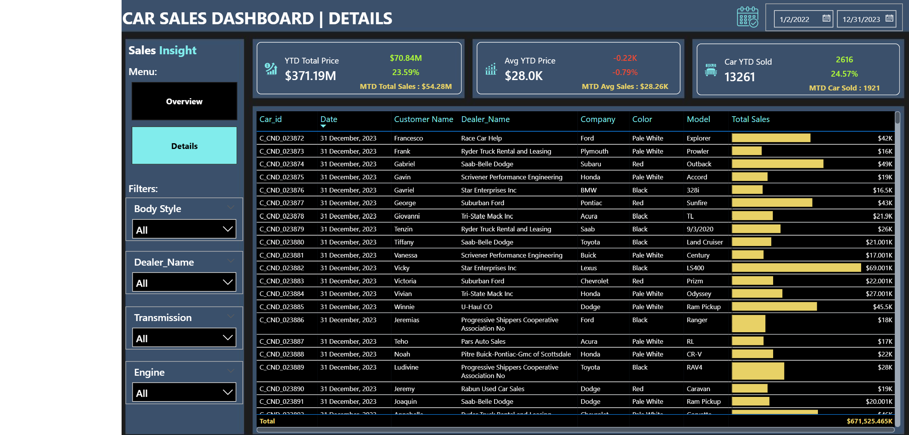

# Car Sales Analysis Using PowerBI

## Preview of the Dashboard

#### Overview Dashboard

#### Details Dashboard

## Key Insights:
1. Total Revenue - As of the start of 2023, Total Sales reached $371.19M, representing a robust 23.59% growth over the previous year. This reflects a net increase of $70.84M in total revenue compared to 2022.
2. Sales Volume -  A total of 13,261 cars have been sold YTD, marking a 24.57% increase over last year.
3. Average Pricing - Despite a rise in overall revenue, the Average current Year Price stands at $28.0K, representing a slight dip of 0.79% compared to last year. This indicates a shift in sales mix toward affordable models, highlighting a volume-led growth strategy.
4. Body Style Popularity - The market is heavily dominated by SUVs and Sedans, which together make up more than half of the total sales.
5. Color Preference - Pale White appears to be the most popular choice, dominating the doughnut chart.

## Modifications applied in the dashboard
1. Change the background Theme from Dark Mode (Black) to Modern Dard Mode Color
2. A condition was added to the KPI cards to dynamically change their color. The card turns green when there is positive growth compared to the previous year or month, and red when there is a decline.
3. Change the color of visualization.
4. Add Calendar in the slicer to filter the date.

## Objective: 
The objective of this project is to design and develop a dynamic and interactive Car Sales Dashboard using Power BI. The dashboard will visualize critical KPIs related to our car sales, helping us understand our sales performance over time and make data-driven decisions.

## Problem Statement 1: KPI’s Requirement
The dashboard should provide real-time insights into key performance indicators (KPIs) related to our sales data. This will enable us to make informed decisions, monitor our progress, and identify trends and opportunities for growth.
1.	Sales Overview:
- Year-to-Date (YTD) Total Sales
- Month-to-Date (MTD) Total Sales
- Difference between YTD Sales and Previous Year-to-Date (PTYD) Sales
- Year-over-Year (YOY) Growth in Total Sales

3.	Average Price Analysis:
- Average Price
- YTD Average Price
- MTD Average Price
- YOY Growth in Average Price
- Difference between YTD Average Price and PTYD Average Price

4.	Cars Sold Metrics:
- YTD Cars Sold
- MTD Cars Sold
- YOY Growth in Cars Sold
- Difference between YTD Cars Sold and PTYD Cars Sold

## Problem Statement 2: Charts Requirement
1.	YTD Sales Weekly Trend: Display a line chart illustrating the weekly trend of YTD sales. The X-axis should represent weeks, and the Y-axis should show the total sales amount.
2.	YTD Total Sales by Body Style: Visualize the distribution of YTD total sales across different car body styles using a Pie chart.
3.	YTD Total Sales by Color: Present the contribution of various car colors to the YTD total sales through a pie chart.
4.	YTD Cars Sold by Dealer Region: Showcase the YTD sales data based on different dealer regions using a map chart to visualize the sales distribution geographically.
5.	Company-Wise Sales Trend in Grid Form: Provide a tabular grid that displays the sales trend for each company. The grid should showcase the company name along with their YTD sales figures.
6.	Details Grid Showing All Car Sales Information: Create a detailed grid that presents all relevant information for each car sale, including car model, body style, colour, sales amount, dealer region, date, etc

## Disclaimer
The procedure was implemented based on the YouTube tutorial **Car Sales Analysis Projects** by **Data Tutorials**. This project is intended for educational purposes only.

## Reference 
[Power BI Dashboard 2025 | Car Sales Analysis Project | End to End Power BI Tutorial for Beginners](https://youtu.be/uPkemycepLc?si=NhYM72UR_J_zB6EZ)
